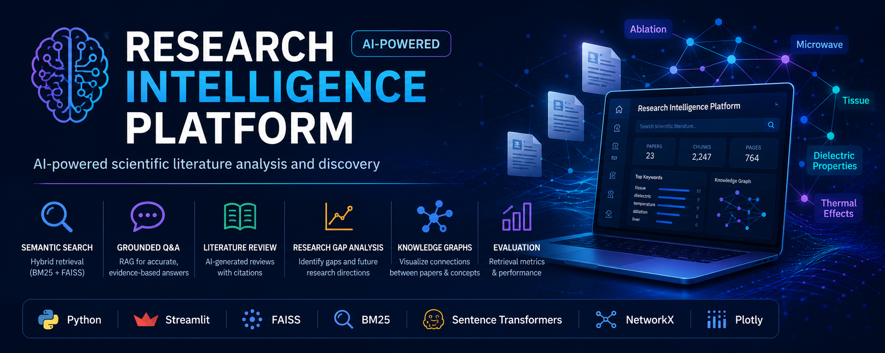
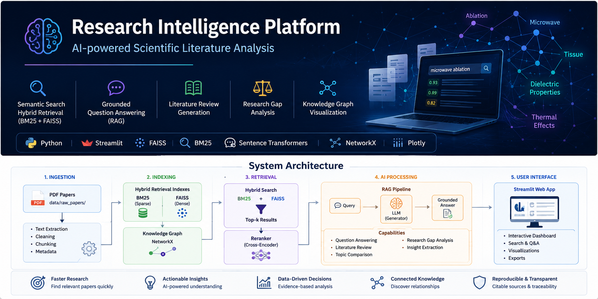

# Research Intelligence Platform

<p align="center">
  
</p>

<p align="center">


</p>

---

## Overview

Research Intelligence Platform is an AI-powered scientific literature analysis system that enables researchers to explore large collections of academic papers through semantic retrieval and Retrieval-Augmented Generation (RAG).

The platform combines hybrid information retrieval (BM25 + FAISS), LLM reasoning, and knowledge graph visualization into a single interactive Streamlit application.

---

## Features

- Hybrid Retrieval (BM25 + FAISS)
- Grounded Question Answering
- Literature Review Generation
- Research Topic Comparison
- Research Gap Analysis
- Paper Inventory
- Interactive Knowledge Graph
- Retrieval Evaluation
- Dashboard Analytics

---

# Demo

## Dashboard


---

## Research Question Answering


---

## Literature Review Generation


---

## Research Topic Comparison


---

## Research Gap Analysis


---

## Knowledge Graph


---

## Retrieval Evaluation


---

# System Architecture

<p align="center">

</p>

The platform follows a five-stage pipeline:

1. PDF Ingestion
2. Hybrid Index Construction
3. Hybrid Retrieval
4. Retrieval-Augmented Generation
5. Interactive Visualization

---

## Technology Stack

| Category | Technology |
|-----------|------------|
| Programming | Python |
| Web Framework | Streamlit |
| Dense Retrieval | FAISS |
| Sparse Retrieval | BM25 |
| Embeddings | Sentence Transformers |
| Knowledge Graph | NetworkX |
| Visualization | Plotly |
| Data Processing | Pandas |

---

## Project Structure

```text
research-intelligence-platform
│
├── app/
├── assets/
│   ├── banner.png
│   ├── architecture.png
│   └── screenshots/
├── data/
│   ├── raw_papers/
│   └── index/
├── requirements.txt
├── README.md
└── LICENSE
```

---

## Installation

Clone the repository

```bash
git clone https://github.com/nick-kar/research_intelligence_platform.git
cd research_intelligence_platform
```

Create a virtual environment

```bash
python -m venv .venv
```

Activate

Windows

```bash
.venv\Scripts\activate
```

Linux/macOS

```bash
source .venv/bin/activate
```

Install dependencies

```bash
pip install -r requirements.txt
```

---

## Build the Search Index

Place PDF papers inside

```text
data/raw_papers/
```

Then run

```bash
python -m app.ingest
```

---

## Launch the Application

```bash
streamlit run app/main.py
```

---

## Current Capabilities

| Module | Status |
|----------|:------:|
| Dashboard | ✅ |
| Hybrid Retrieval | ✅ |
| Question Answering | ✅ |
| Literature Review | ✅ |
| Topic Comparison | ✅ |
| Research Gap Analysis | ✅ |
| Knowledge Graph | ✅ |
| Retrieval Evaluation | ✅ |

---

## Roadmap

- Cross-Encoder Reranking
- Citation Network Visualization
- Multi-document Summarization
- PDF Annotation
- arXiv Integration
- PubMed Integration
- CrossRef Integration
- Docker Support
- Multi-user Authentication

---

## Motivation

This project demonstrates practical applications of:

- Information Retrieval
- Scientific Document Intelligence
- Retrieval-Augmented Generation (RAG)
- Knowledge Graphs
- Natural Language Processing
- Interactive AI Systems

---

## License

MIT License

---

## Support

If you found this repository useful, consider giving it a ⭐.